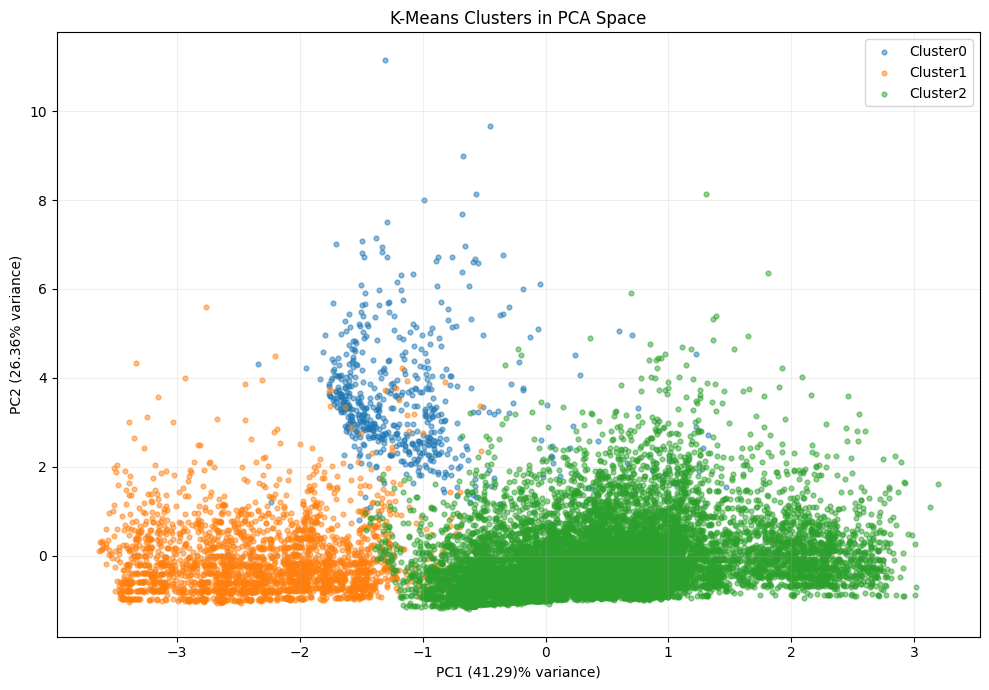
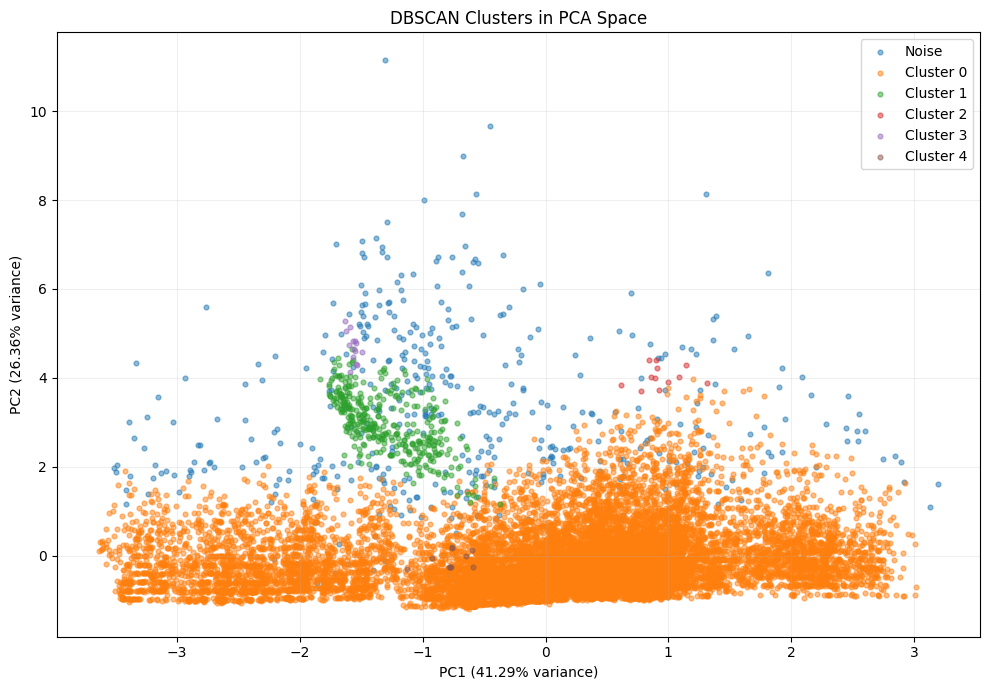

# Seismic Data ML Research

## Overview

This repository contains the code, analysis, and results for a graduate-level computer science capstone project applying machine learning and data analysis techniques to a historical earthquake catalog.

The project uses earthquake data from Japan to explore **spatial, temporal, and feature-level patterns** in observed seismic events. The analysis focuses on how computational methods can be used to organize, transform, and examine multidimensional seismic data.

Rather than attempting to predict future earthquakes, this project uses **unsupervised machine learning** to explore patterns within an existing seismic event catalog.

---

## Project Objectives

The project was developed to:

* Prepare and validate a real-world seismic dataset for machine learning analysis.
* Explore the characteristics and relationships of selected earthquake features.
* Prepare seismic features for machine learning through data cleaning and transformation.
* Apply **Principal Component Analysis (PCA)** for dimensionality reduction.
* Apply **K-Means and DBSCAN** clustering to the prepared data.
* Compare and interpret the patterns produced by different unsupervised learning approaches.
* Demonstrate a reproducible Python-based machine learning workflow using real-world data.

---

## Dataset

The analysis uses the **Earthquakes in Japan** dataset covering earthquake events from **2001–2018**.

The dataset contains recorded earthquake information including variables such as:

* Magnitude
* Depth
* Latitude
* Longitude
* Date and time
* Other recorded seismic attributes

The original dataset was obtained from Kaggle and is **not redistributed in this repository**.

Instructions for obtaining and preparing the dataset are documented in [`data/README.md`](data/README.md).

---

## Methodology

The project follows a structured data analysis and unsupervised machine learning workflow.

### 1. Data Preparation

The earthquake catalog is examined and prepared for analysis through processes including:

* Data inspection
* Data-type validation
* Missing-value assessment
* Duplicate assessment
* Feature selection
* Data cleaning and transformation

The goal is to produce a consistent dataset suitable for subsequent exploratory analysis and machine learning.

### 2. Exploratory Data Analysis

Exploratory data analysis is used to examine the characteristics and relationships of the selected seismic variables.

The analysis considers dimensions such as:

* Earthquake magnitude
* Earthquake depth
* Geographic coordinates
* Temporal characteristics
* Relationships among selected features

The exploratory analysis provides context for the subsequent machine learning steps.

### 3. Principal Component Analysis

**Principal Component Analysis (PCA)** is applied as a dimensionality-reduction technique.

PCA transforms the selected features into principal components that represent the major sources of variation within the feature space. The resulting representation is then used to support visualization and clustering analysis.

### 4. Unsupervised Clustering

Two unsupervised machine learning approaches are applied:

* **K-Means clustering**
* **DBSCAN clustering**

K-Means partitions observations into a predefined number of clusters based on feature similarity, while DBSCAN identifies groups based on the density of observations and can distinguish observations that do not belong to dense clusters.

The two approaches provide complementary ways of examining structure within the seismic dataset.

### 5. Pattern Interpretation

The resulting clustering structures are examined through quantitative outputs and visualizations.

The analysis focuses on:

* Characteristics of the resulting clusters
* Relationships among the selected seismic features
* Differences between K-Means and DBSCAN results
* Patterns visible after dimensionality reduction
* Limitations associated with interpreting unsupervised clusters

The purpose is to evaluate the usefulness of these computational techniques for **exploratory analysis of seismic data**, rather than to establish physical causation or develop an operational forecasting system.

---

## Project Structure

```text
seismic-data-ml-research/
│
├── README.md
├── requirements.txt
├── .gitignore
│
├── notebooks/
│   ├── 01_EDA_Data_Cleaning.ipynb
│   ├── 02_ML_Modeling.ipynb
│   └── README.md
│
├── data/
│   └── README.md
│
├── results/
│   ├── README.md
│   └── figures/
│       ├── pca_kmeans.png
│       └── pca_dbscan.png
│
└── src/
    └── README.md
```

The repository structure is designed to separate analysis notebooks, data documentation, generated results, and reusable source code.

---

## Technologies

* **Python**
* **Pandas**
* **NumPy**
* **Matplotlib**
* **Seaborn**
* **Scikit-learn**
* **Jupyter Notebook**

---

## Key Areas of Analysis

The project demonstrates several areas of computer science and data analysis.

### Data Preparation

* Data ingestion
* Data validation
* Data cleaning
* Feature selection
* Feature preparation

### Exploratory Data Analysis

* Descriptive analysis
* Feature relationships
* Spatial characteristics
* Temporal characteristics
* Multidimensional data exploration

### Machine Learning

* Principal Component Analysis
* Dimensionality reduction
* K-Means clustering
* DBSCAN clustering
* Unsupervised pattern analysis

### Data Visualization

* Exploratory visualizations
* PCA-based visualization
* Cluster visualization
* Comparative interpretation of machine learning results

---

## Results

The analysis demonstrates how dimensionality reduction and unsupervised clustering can be applied to a historical earthquake catalog to explore structure within multidimensional seismic data.

### PCA + K-Means

The PCA-reduced feature space was used to visualize the K-Means clustering results.



### PCA + DBSCAN

The PCA-reduced feature space was also used to visualize the DBSCAN clustering results.



These visualizations provide a direct comparison of the patterns identified by the two unsupervised clustering approaches.

---

## Limitations

Several limitations should be considered when interpreting the results:

* The analysis is based on a historical earthquake catalog and therefore reflects the characteristics and limitations of the available data.
* Results depend on the selected features and preprocessing decisions.
* Clustering results are sensitive to algorithm-specific parameters.
* Unsupervised clusters do not necessarily correspond to distinct physical or geological earthquake processes.
* The analysis identifies patterns in observed data but does not establish causal relationships.
* The project does not provide earthquake prediction or operational earthquake forecasting.

---

## Future Work

Potential extensions of the project include:

* Incorporating more recent seismic observations.
* Exploring additional feature-engineering strategies.
* Evaluating additional clustering algorithms.
* Investigating alternative dimensionality-reduction techniques.
* Comparing clustering results across different parameter configurations.
* Expanding visualization and analytical capabilities.
* Developing a more comprehensive and repeatable seismic-data processing pipeline.

---

## Academic Context

This project was developed as a graduate capstone project for the **Master of Science in Computer Science** program at City University of Seattle.

The project demonstrates the application of computer science concepts—including data preparation, exploratory data analysis, dimensionality reduction, unsupervised machine learning, clustering, and visualization—to a real-world seismic dataset.

---

## Author

**Geraldine I. Marten-Ellis**

Graduate Student — Master of Science in Computer Science
City University of Seattle
